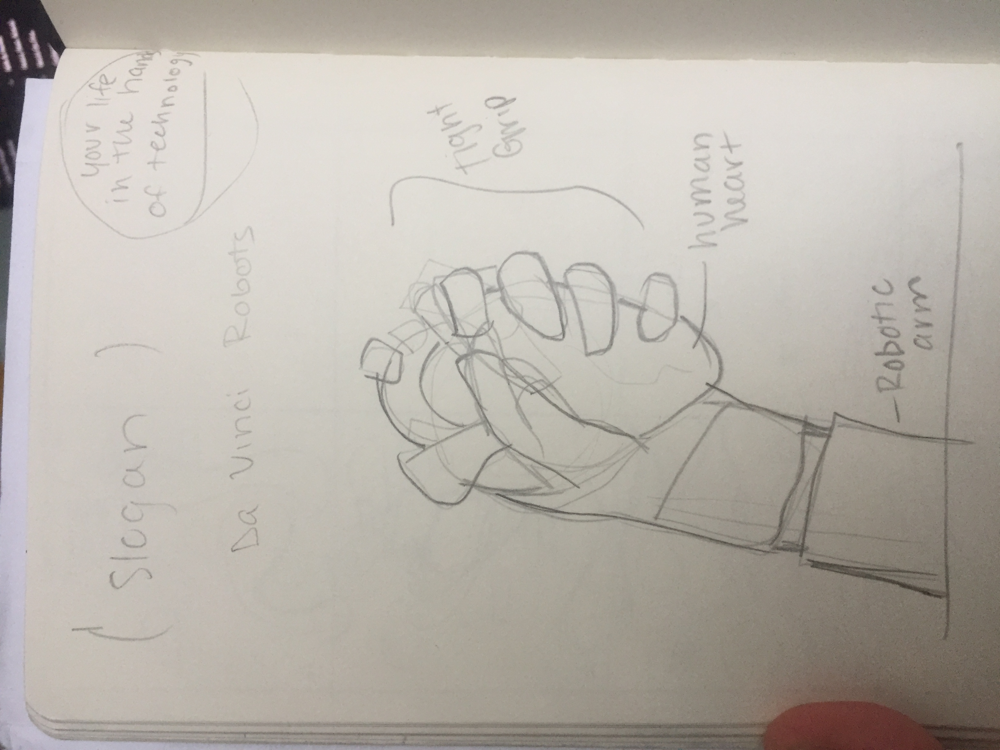

**Relationship to Research:** For my project I wanted to make a satirical ad/poster design either hand drawn or done in illustrator. The image would depict a robot hand holding a human heart, but it would be holding it tightly to show people's discomfort with their life being in the hands of technology. The top of the image would have a slogan promoting the Da Vinci robot. The image is a rough sketch of the layout of the poster.

**Why I Chose This:** I chose this because I want to get people to think about how although medical robots are more precise and cheaper, many people would choose to have a human operate on them than a robot.

