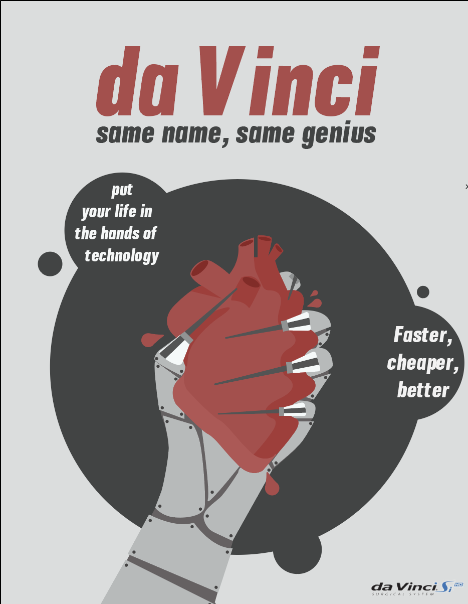

**Relationship to Final:** The poster I designed was based off my sketch. The robotic hand symbolizes medical robots, however, the fingers mimics the design of the da Vinci itself. The hand is holding a human heart tightly to show that people feel uncomfortable when there lives are in the hands of technology. The idea is reinforced through the text bubbles.

**Why I Chose This:** I chose to document my project this way because I thought it would be a good way to reach others that might seek medical help in the future. I thought it would be interesting to do something satirical especially with an issue that has strong pros and cons.

Image 3-Final Project: Satirical advertisement poster for the da Vinci Robot- 30 April 2019- digital illustrator file- 11x8.5 in
